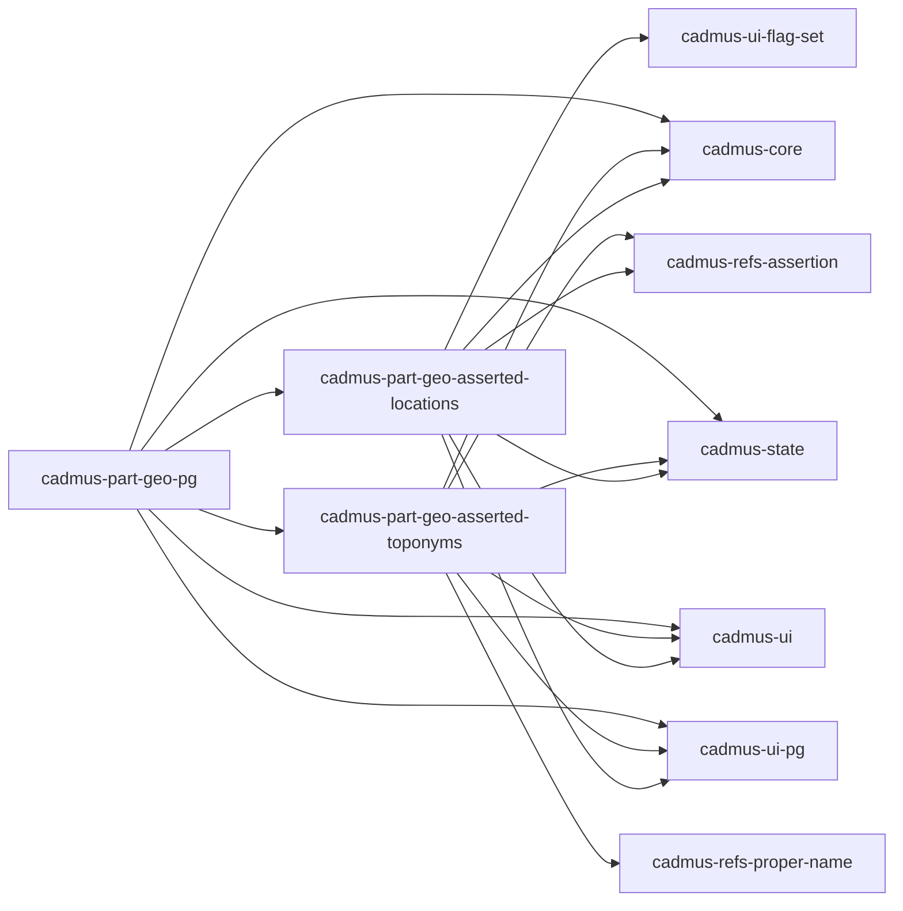

# Cadmus Geography Shell

This project was generated using [Angular CLI](https://github.com/angular/angular-cli) version 19.0.6.

- [models](https://github.com/vedph/cadmus-geo)
- [API](https://github.com/vedph/cadmus-geo-api)

This shell is used to develop Cadmus frontend geography libraries.

## Docker

🐋 Quick Docker image build:

1. `npm run build-lib`;
2. update version in `env.js` and `ng build`;
3. `docker build . -t vedph2020/cadmus-geo-shell:1.0.0 -t vedph2020/cadmus-geo-shell:latest` (replace with the current version).

## Components



## Requirements

This requires **Leaflet** via [ngx-leaflet](https://github.com/bluehalo/ngx-leaflet).

▶️ (1) install packages:

```bash
npm install leaflet @asymmetrik/ngx-leaflet
npm install --save-dev @types/leaflet
```

▶️ (2) in `angular.json` under `styles` add the leaflet CSS stylesheet:

```json
"styles": [
  "./node_modules/leaflet/dist/leaflet.css"
]
```

▶️ (3) manually copy images from `node_modules/leaflet/dist/images` to `public/img`.

▶️ (4) import the corresponding module in your root component or module:

```ts
import { LeafletModule } from '@asymmetrik/ngx-leaflet';

...
imports: [
  LeafletModule
]
...
```

## History

### 11.0.0

- 2025-09-16:
  - updated Angular and packages.
  - refactored components state to fully reactive.
  - ⚠️ replaced legacy module with routes in PG library.
- 2025-06-07: updated Angular and packages.

### 10.0.0

- 2025-06-03: ⚠️ upgraded to Angular 20 bumping major version to 10.

### 9.0.0

- 2025-01-28: ⚠️ updated Cadmus dependencies for signals. The only relevant change (apart from version numbers) is changing part feature data change event handler: `(dataChange)="save($event!.value!)"`.

### 8.0.1

- 2025-01-24: ⚠️ moved components to signals. This affects only inner components, as part components do not use input or outputs.

### 8.0.0

- 2025-01-03: ⚠️ updated [Cadmus dependencies](https://github.com/vedph/cadmus-shell-v3) to version 11 (standalone components).

### 7.0.0

- 2025-01-01:
  - ⚠️ standalone components in libraries.
  - refactored shell app for modern Angular.

### 6.1.1

- 2024-12-30: adjusted peer dependencies.

### 6.1.0

- 2024-12-23: ⚠️ upgraded to [bricks V3](https://github.com/vedph/cadmus-bricks-shell-v3).

### 6.0.0

- 2024-12-03: ⚠️ upgraded to new core dependencies.

### 5.0.0

- 2024-11-22: ⚠️ upgraded to Angular 19.
- 2024-11-18: updated Angular and packages.

### 4.1.1

- 2024-06-09:
  - updated Angular and packages.
  - added `class="mat-X"` for each `color="X"` (e.g. `class="mat-primary"` wherever there is a `color="primary"`) to allow transitioning to Angular Material M3 from M2. This also implies adding it directly to the target element, so in the case of `mat-icon` inside a `button` with `color` the class is added to `mat-icon` directly (unless the button too has the same color). This allows to keep the old M2 clients while using the new M3, because it seems that the compatibility mixin is not effective in some cases like inheritance of `color`, and in the future `color` will be replaced by `class` altogether.
  - updated to modern control flow syntax.
  - applied M3 theming.

### 4.1.0

- 2024-05-24: ⚠️ upgraded to Angular 18. All libraries bumped their **version** to 4.1.0.
- 2024-04-13: ⚠️ upgraded to [bricks V2](https://github.com/vedph/cadmus-bricks-shell-v2). All libraries bumped their **version** to 4.0.0.
- 2024-03-22: ⚠️ replaced MapboxGL with Leaflet, updating `@myrmidon/cadmus-part-geo-asserted-locations` version. This is a breaking change for clients, which should replace the mapping library.
- 2024-03-21: updated Angular and packages, replacing `ngx-monaco-editor` with [ngx-monaco-editor-v2](https://github.com/miki995/ngx-monaco-editor-v2). This changes affects only the shell UI, not the libraries.

### 2.0.0

- 2023-11-09: ⚠️ upgraded to Angular 17.
- 2023-11-07:
  - updated Angular and packages.
  - removed ELF.
  - opted in thesauri import.

### 1.0.0

- 2023-06-17:
  - updated Angular and packages.
  - moved to PostgreSQL.
- 2023-05-24: updated Angular and packages. No changes required for introducing AssertedCompositeId here, so libraries versions stay the same.
- 2023-05-12: updated to Angular 16.
- 2023-02-11:
  - updated packages.
  - fixes to asserted toponyms.
- 2023-01-17:
  - layout of location part.
  - fixes to toponym editor.
  - updated packages.

### 0.0.2

- 2023-01-12:
  - added tag to location and toponym.
  - updated Angular and packages.
