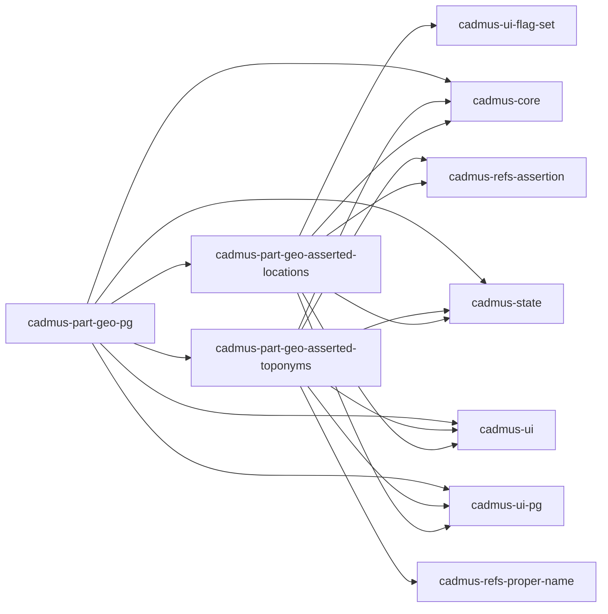

# Cadmus Geography Shell

This project was generated using [Angular CLI](https://github.com/angular/angular-cli) version 19.0.6.

- [models](https://github.com/vedph/cadmus-geo)
- [API](https://github.com/vedph/cadmus-geo-api)

This shell is used to develop Cadmus frontend geography libraries.

## Docker

🐋 Quick Docker image build:

1. `pnpm run build-lib`;
2. update version in `env.js` and `ng build`;
3. `docker build . -t vedph2020/cadmus-geo-shell:1.0.0 -t vedph2020/cadmus-geo-shell:latest` (replace with the current version).

## Components

```mermaid
graph LR;
  cadmus-part-geo-asserted-locations --> cadmus-refs-assertion
  cadmus-part-geo-asserted-locations --> cadmus-ui-flag-set
  cadmus-part-geo-asserted-locations --> cadmus-core
  cadmus-part-geo-asserted-locations --> cadmus-state
  cadmus-part-geo-asserted-locations --> cadmus-ui
  cadmus-part-geo-asserted-locations --> cadmus-ui-pg

  cadmus-part-geo-asserted-toponyms --> cadmus-refs-assertion
  cadmus-part-geo-asserted-toponyms --> cadmus-refs-proper-name
  cadmus-part-geo-asserted-toponyms --> cadmus-core
  cadmus-part-geo-asserted-toponyms --> cadmus-state
  cadmus-part-geo-asserted-toponyms --> cadmus-ui
  cadmus-part-geo-asserted-toponyms --> cadmus-ui-pg

  cadmus-part-geo-pg --> cadmus-core
  cadmus-part-geo-pg --> cadmus-state
  cadmus-part-geo-pg --> cadmus-ui
  cadmus-part-geo-pg --> cadmus-ui-pg
  cadmus-part-geo-pg --> cadmus-part-geo-asserted-locations
  cadmus-part-geo-pg --> cadmus-part-geo-asserted-toponyms
```
